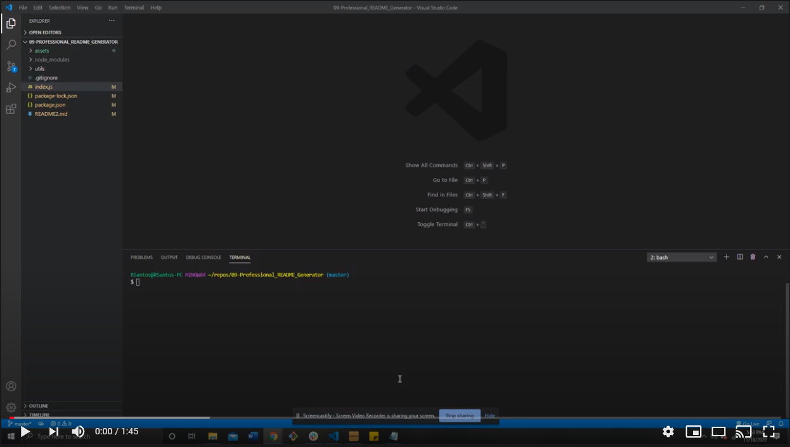
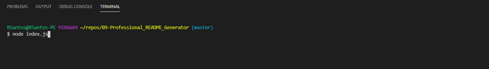
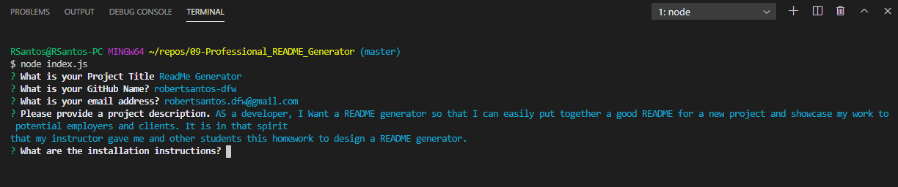
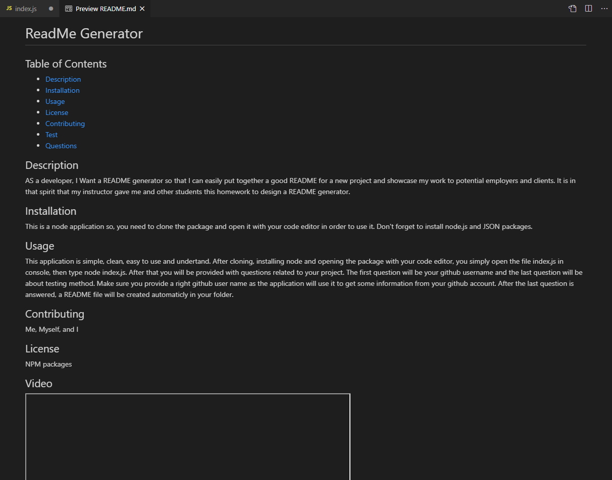

# ReadMe Generator

## Table of Contents

* [Description](#description)
* [Installation](#installation)
* [Usage](#usage)
* [License](#license)
* [Contributing](#contributing)
* [Test](#test)
* [Questions](#questions)

## Description 

AS a developer, I Want a README generator so that I can easily put together a good README for a new project and showcase my work to potential employers and clients. It is in that spirit that my instructor gave me and other students this homework to design a README generator.

## Installation

This is a node application so, you need to clone the package and open it with your code editor in order to use it. Don't forget to install node.js and JSON packages.

## Usage 

This application is simple, clean, easy to use and undertand. After cloning, installing node and opening the package with your code editor, you simply open the file index.js in console, then type node index.js. After that you will be provided with questions related to your project. The first question will be your github username and the last question will be about testing method. Make sure you provide a right github user name as the application will use it to get some information from your github account. After the last question is answered, a README file will be created automaticly in your folder.

## License

NPM packages

## Video

## Badges

## Contributing

Me, Myself, and I

## Tests

The current texting method is console.log

## Questions

* GitHub Repo https://github.com/robertsantos-dfw

You can reach me by emailing me at robertsantos.dfw@gmail.com with any additional questions.

## Screenshots

* Getting Started

* Answer Questions

* Preview ReadMe File

---
© 2019 Trilogy Education Services, a 2U, Inc. brand. All Rights Reserved.
